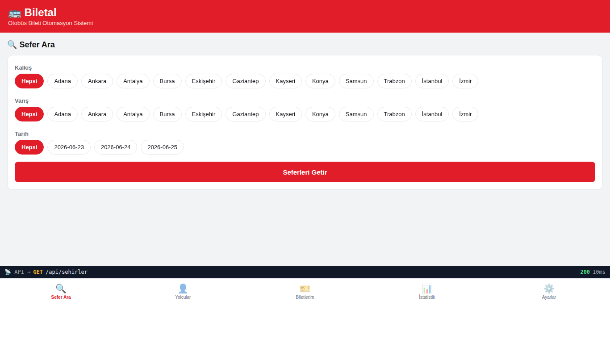

# Biletal — Otobüs Bileti Otomasyon Sistemi

> Mikroservis tabanlı bir **otobüs bilet satış / sefer yönetimi / yolcu kayıt**
> prototipi. Bir otobüs firmasının bilet süreçlerini uçtan uca dijitalleştirir.

---

## Proje Hakkında



**Proje Tanımı:**
> Biletal; bir otobüs firmasının bilet satış, sefer yönetimi ve yolcu kayıt
> süreçlerini dijitalleştiren **mikroservis tabanlı bir Otobüs Bileti Otomasyon
> Sistemi** prototipidir. Kullanıcılar mobil uyumlu arayüz üzerinden şehirler
> arası seferleri arar, koltuk haritasından koltuk seçer, yolcu bilgilerini
> kaydeder ve bilet satın alır. Bilet alındığında sistem, yolcuya gönderilecek
> bildirimi bir mesaj kuyruğuna bırakır; arka planda çalışan ayrı bir servis bu
> bildirimi (SMS / e-posta simülasyonu) işler. Sefer arama sonuçları, yükü
> azaltmak için önbelleğe alınır. Tüm bileşenler Docker üzerinde tek komutla
> ayağa kalkar ve Jenkins ile sürekli entegrasyon/dağıtım (CI/CD) yapılır.

**Proje Kategorisi:**
> Ulaşım / Online Bilet Satış (Seyahat Teknolojileri)

**Referans Uygulama:**
> [Obilet](https://www.obilet.com) — Türkiye'nin önde gelen online otobüs/uçak
> bileti satış platformu.

---

## Proje Linkleri

> Proje **yerel Docker ortamında** çalışır (derste yerel çalıştırma yeterlidir).

- **REST API Adresi (Swagger):** [http://localhost:8000/docs](http://localhost:8000/docs)
- **Web Frontend Adresi:** [http://localhost:8082](http://localhost:8082)
- **RabbitMQ Yönetim Arayüzü:** [http://localhost:15672](http://localhost:15672) (guest / guest)
- **Jenkins CI/CD:** [http://localhost:8091](http://localhost:8091) (admin / admin)
- **Kaynak Kod:** [github.com/betulerkocc/biletal](https://github.com/betulerkocc/biletal)

---

## Proje Ekibi

**Grup Adı:** Biletal

**Ekip Üyeleri:**
- Betül Erkoç (Grup Lideri — Tam Yığın: REST API · Mobil · Web · Mobil Backend)

> Tek kişilik proje: 10 gereksinim, doğrudan 10 REST API uç noktasına karşılık gelir.

---

## Dokümantasyon

Proje dokümantasyonuna aşağıdaki linklerden erişebilirsiniz:

1. [Gereksinim Analizi](Gereksinim-Analizi.md)
2. [REST API Tasarımı (OpenAPI)](API-Tasarimi.md)
3. [REST API Görev Dağılımı](Rest-API.md)
4. [Web Front-End](WebFrontEnd.md)
5. [Mobil Front-End](MobilFrontEnd.md)
6. [Mobil Backend](MobilBackEnd.md)
7. [Video Sunum](Sunum.md)

---

## 🧱 Mimari (Microservices)

```
┌─────────────────────────┐        HTTP/REST         ┌──────────────────────────┐
│  Frontend (React Native │ ───────────────────────► │   Backend (FastAPI)      │
│  / Expo)  · web :8082   │ ◄─────────────────────── │   :8000  · /docs Swagger │
└─────────────────────────┘        JSON               └───────────┬──────────────┘
        Mobil uyumlu                                               │
        (iOS / Android / Web)              ┌────────────┬──────────┼───────────┐
                                           ▼            ▼          ▼
                                  ┌──────────────┐ ┌─────────┐ ┌──────────────────┐
                                  │ MongoDB :27017│ │Redis    │ │ RabbitMQ :5672   │
                                  │ (kalıcı veri) │ │:6379    │ │ :15672 yönetim   │
                                  │ Volume:       │ │(cache)  │ │ (mesaj kuyruğu)  │
                                  │ mongo_data    │ └─────────┘ └────────┬─────────┘
                                  └──────────────┘                       │ tüketir
                                                                 ┌───────▼─────────┐
                                                                 │ Worker (bildirim)│
                                                                 │ SMS/E-posta sim. │
                                                                 └──────────────────┘
```

| Katman | Teknoloji | Görev |
|---|---|---|
| **Veritabanı** | MongoDB 7 (NoSQL, BSON) | Kalıcı veri — `mongo_data` Docker Volume |
| **Backend** | FastAPI (Python, async) | **10 REST uç noktası** + Swagger (`/docs`) |
| **Cache** | Redis 7 | Sefer arama sonuçlarını önbellekler (HIT/MISS) |
| **Mesaj Kuyruğu** | RabbitMQ 3 | Bilet alımında async bildirim olayı |
| **Worker** | Python (aio-pika) | Kuyruğu tüketir, bildirim "gönderir" |
| **Frontend** | React Native / Expo | Mobil uyumlu arayüz (web simülasyon :8082) |
| **Orkestrasyon** | Docker Compose | Tek komutla tüm servisler |
| **CI/CD** | Jenkins (Declarative Pipeline) | Build → Deploy → Health → Test |

---

## 🚀 Hızlı Başlangıç (tek komut)

> Gereksinim: Docker + Docker Compose v2.

```bash
docker compose up -d --build
```

Hepsi bu kadar. Ardından:

| Servis | Adres |
|---|---|
| 🖥️ **Uygulama (web)** | http://localhost:8082 |
| 📘 **Swagger API** | http://localhost:8000/docs |
| 🩺 **Health** | http://localhost:8000/health |
| 🐇 **RabbitMQ Yönetim** | http://localhost:15672 (guest / guest) |

Durdurmak için: `docker compose down`  (veriyi de silmek için `-v` ekleyin).

### Uçtan uca testi çalıştır

```bash
bash scripts/smoke_test.sh
```

10 uç noktayı + Redis HIT/MISS + RabbitMQ akışını otomatik doğrular.

### Demo verisini sıfırla

```bash
bash scripts/reset.sh
```

---

## 📱 Mobil uygulamayı emülatörde / cihazda çalıştırma

```bash
cd frontend
npm install        # ilk sefer
npx expo start     # QR kod çıkar
```

- **Android emülatör:** Expo'da `a` tuşu. (API adresi otomatik `10.0.2.2:8000`)
- **iOS simülatör:** `i` tuşu. (API `localhost:8000`)
- **Gerçek cihaz:** Expo Go ile QR okut. Uygulamada **Ayarlar** sekmesinden
  API adresini `http://<bilgisayar-IP>:8000` yapın.
- **Web simülasyon:** `npx expo start --web` → tarayıcıda açılır.

> Uygulamanın altındaki **API Log çubuğu**, mobilden REST API'ye giden her
> isteği (metot, yol, HTTP durumu, süre, Redis HIT/MISS) **canlı** gösterir.

---

## 🔌 REST API — 10 Uç Nokta

| # | Gereksinim | Metot | Yol | Açıklama |
|---|---|---|---|---|
| 1 | Şehirleri Listeleme | GET | `/api/sehirler` | Şehirleri listele |
| 2 | Sefer Arama | GET | `/api/seferler` | Sefer ara/listele — **Redis cache** (HIT/MISS) |
| 3 | Sefer Ekleme | POST | `/api/seferler` | Yeni sefer ekle (cache temizlenir) |
| 4 | Sefer Detayı Görüntüleme | GET | `/api/seferler/{sefer_id}` | Sefer detayı + koltuk haritası |
| 5 | Yolcu Kaydetme | POST | `/api/yolcular` | Yolcu kaydı oluştur |
| 6 | Yolcuları Listeleme | GET | `/api/yolcular` | Yolcuları listele |
| 7 | Bilet Satın Alma | POST | `/api/biletler` | Bilet satın al — **RabbitMQ olayı yayınlar** |
| 8 | Biletleri Listeleme | GET | `/api/biletler` | Biletleri listele |
| 9 | Bilet İptal Etme | DELETE | `/api/biletler/{bilet_id}` | Bilet iptal et |
| 10 | İstatistikleri Görüntüleme | GET | `/api/istatistik` | Dashboard istatistikleri |

Ek: `GET /health` (Mongo/Redis/RabbitMQ durumu), `GET /` (özet).

> **Not:** Bu API kimlik doğrulama (JWT/Bearer) **kullanmaz** — prototip kapsamında
> tüm uç noktalar herkese açıktır.

---

## ⚡ Redis nasıl kullanılıyor?

`GET /api/seferler` araması önce Redis'te aranır:
- **İlk istek →** MongoDB sorgulanır, sonuç Redis'e yazılır → yanıt `cache: MISS`.
- **Tekrar istek →** Redis'ten döner → `cache: HIT` (çok daha hızlı, `X-Cache: HIT` başlığı).
- Yeni sefer eklenince / bilet alınınca / iptal edilince ilgili cache **otomatik temizlenir**.

Uygulamada "Sefer Ara" ekranında HIT/MISS ve süre (ms) büyük puntoyla görünür.

## 🐇 RabbitMQ nasıl kullanılıyor?

`POST /api/biletler` ile bilet alındığında backend, `ticket_events` kuyruğuna
bir olay yayınlar. Ayrı çalışan **worker** servisi bu olayı tüketir ve yolcuya
bildirim (SMS + E-posta simülasyonu) "gönderir", MongoDB'ye `bildirimler`
kaydı yazar.

Canlı izlemek için:
```bash
docker compose logs -f worker      # her bilet alımında işlenişi gör
```
ve **http://localhost:15672** (RabbitMQ yönetim arayüzü) → kuyruk hareketi.

---

## 🐳 Docker + 🔧 Jenkins CI/CD

- **Frontend ve Backend dahil tüm servisler Docker ile çalışır** (`docker compose up -d --build`).
- Frontend konteyneri ödev gereği `network_mode: "host"` ile yayın yapar.
- **Jenkins pipeline** (`Jenkinsfile`): `Checkout → Build & Deploy → Health Check → Smoke Test`.

Projeye özel, Docker erişimli Jenkins'i çalıştırmak için → **[jenkins/SETUP.md](jenkins/SETUP.md)**

```bash
cd jenkins && docker compose -f docker-compose.jenkins.yml up -d --build
# http://localhost:8091  (admin/admin) → obilet-ci → Build Now
```

---

## 📂 Proje Yapısı

```
biletal/
├── Readme.md                   # bu dosya (proje ana sayfası)
├── Gereksinim-Analizi.md       # gereksinim listesi + dağılım
├── API-Tasarimi.md             # OpenAPI 3.0 tasarımı
├── biletal-api.yaml            # OpenAPI spesifikasyonu (makinece okunur)
├── Rest-API.md / WebFrontEnd.md / MobilFrontEnd.md / MobilBackEnd.md / Sunum.md
├── Betül-Erkoç/                # ekip üyesi görev dosyaları
├── docker-compose.yml          # tüm servisler (mongo/redis/rabbitmq/backend/worker/frontend)
├── Jenkinsfile                 # CI/CD pipeline
├── backend/                    # FastAPI (app/main.py, app/routers/, app/cache.py, app/mq.py)
├── worker/                     # RabbitMQ tüketici (bildirim worker'ı)
├── frontend/                   # React Native / Expo (App.tsx, src/screens/...)
├── jenkins/                    # Docker erişimli özel Jenkins (Dockerfile, casc.yaml, SETUP.md)
├── scripts/                    # smoke_test.sh, reset.sh
└── docs/DEMO.md                # video çekim senaryosu (gereksinim → kanıt)
```

> **Teknik not:** Docker proje ad alanı (container ön eki) `obilet-` olarak
> bırakılmıştır; bu yalnızca dahili servis adlandırmasıdır ve uygulamanın adı
> **Biletal**'dir.

Detaylı video çekim rehberi: **[docs/DEMO.md](docs/DEMO.md)** ve **[Sunum.md](Sunum.md)**
